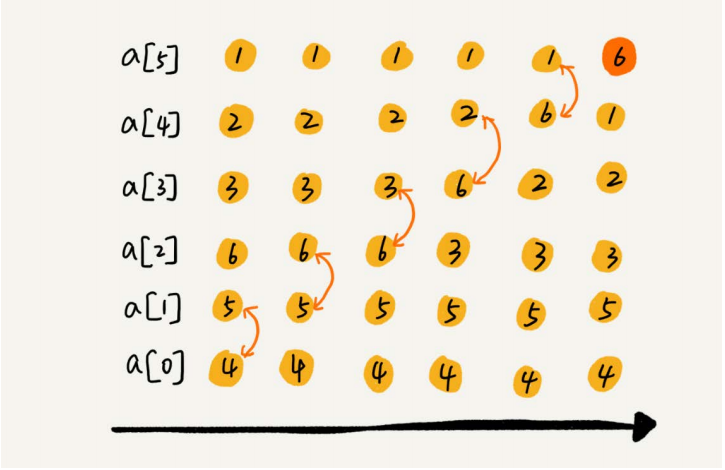
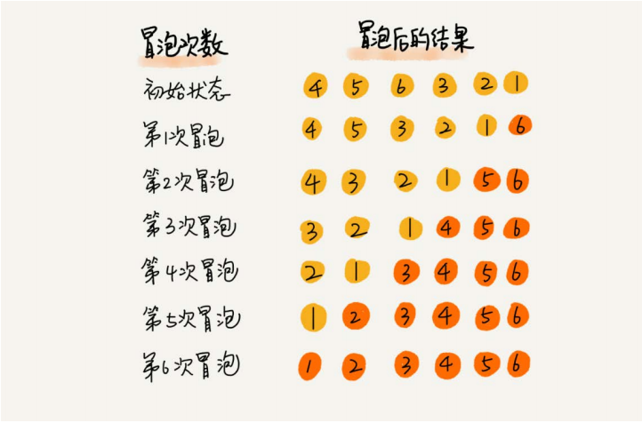

[TOC]
# 排序
## 排序算法分析
| 排序算法 | 时间复杂度 | 是否基于比较 |
| ---- | ---- | ---- |
| 冒泡、插入、选择 |O(n^2)|是|
|快排、归并|O(nlogn)|是|
|桶、计数、基数|O(n)|否|

| 排序算法 | 是原地排序 | 是否稳定 | 最好 | 最坏 | 平均 | 
| ---- | ---- | ---- | ---- | ---- | ---- |
| 冒泡排序 |是|是|O(n)|O(n^2)|O(n^2)|
| 插入排序 |是|是|O(n)|O(n^2)|O(n^2)|
| 选择排序 |是|否|O(n^2)|O(n^2)|O(n^2)|
### 如何分析排序算法
* 最好情况、最坏情况、平均情况时间复杂度
* 时间复杂度的系数、常数 、低阶
* 比较次数和交换（或移动）次数
### 排序算法稳定性
比如我们有一组数据2，9，3，4，8，3，按照大小排序之后就是2，3，3，4，8，9，如果前后两个3顺序不变，那就是稳定排序算法，如果顺序变了就是不稳定排序算法
## 冒泡排序（Bubble Sort）
### 过程  
  
  
### 代码
```java
import java.util.Arrays;

/**
 * 冒泡排序
 */
public class BubbleSort {
    public static void main(String[] args) {
        System.out.println(Arrays.toString(bubbleSort(new int[]{6,5,4,3,2,1})));
    }
    public static int[] bubbleSort(int[] array){
        boolean flag = false;
        for(int i=0;i<array.length;i++){
            for(int j=0;j<array.length-i-1;j++){
                if(array[j]>array[j+1]){
                    int t = array[j];
                    array[j] = array[j+1];
                    array[j+1] = t;
                    flag = true;
                }
            }
            if(!flag){
                break;
            }
        }
        return array;
    }
}
```
###  分析平均复杂度
####有序度
##### 概念
有序度是数组中具有有序关系的元素对的个数，比如2，4，3，1，5，6，有序度为11，因为有序元素有11个，(2,4),(2,3),(2,5),(2,6),(4,5),(4,6),(3,5),(3,6),(1,5),(1,6),(5,6)。
##### 公式
* 满有序度=n*(n-1)/2
* 逆序度=满有序度-有序度
##### 分析
* 每交换一次有序度加1，所以如果是最坏情况下要交换n*(n-1)/2次
* 取中间值n*(n-1)/4
* 比较操作要比交换操作多，复杂度的上限是O(n^2)  
**结论：平均情况下的时间复杂度就是O(n^2)**
### 总结
* 插入排序是原地排序算法
* 插入排序是稳定的排序算法
* 插入排序最好是时间复杂度为O(n)，最坏情况时间复杂度为O(n^2)，平均复杂度是O(n^2)
## 插入排序（Insertion Sort）
### 过程
  
### 代码
```java
import java.util.Arrays;

/**
 * 插入排序
 */
public class InsertionSort {
    public static void main(String[] args) {
        System.out.println(Arrays.toString(insertionSort(new int[]{6,5,4,3,2,1})));
    }
    public static int[] insertionSort(int[] array){
        for(int i=1;i<array.length;i++){
            int j =i-1;
            int t = array[i];//要插入的数据
            for(;j>=0;j--){
                if(t<array[j]){
                    array[j+1] = array[j];
                }else{
                    break;
                }
            }
            array[j+1] = t;//插入数据
        }
        return array;
    }
}
```
### 总结
* 插入排序为原地排序算法
* 插入排序为稳定排序算法
* 最坏时间复杂度为O(n^2),最好时间复杂度为O(n),平均复杂度为O(n^2)
## 选择排序（Selection Sort）
### 原理
选择最小的数放到已排序区间的尾端
### 过程
  
### 代码
```java
import java.util.Arrays;

public class SelectionSort {
    public static void main(String[] args) {
        System.out.println(Arrays.toString(selectionSort(new int[]{4,5,6,3,2,1})));
    }

    public static int[] selectionSort(int[] array) {
        for (int i = 0; i < array.length; i++) {
            int j=i+1;
            int min = i;
            for(;j<array.length;j++){
                if(array[j]<array[min]){
                    min = j;
                }
            }
            int t = array[i];
            array[i] = array[min];
            array[min] = t;
            System.out.println(Arrays.toString(array));
        }
        return array;
    }
}
```
### 总结
* 选择排序是原地排序算法
* 选择排序不是稳定排序算法
* 选择排序最好，最坏，平均复杂度都是O(n^2)
